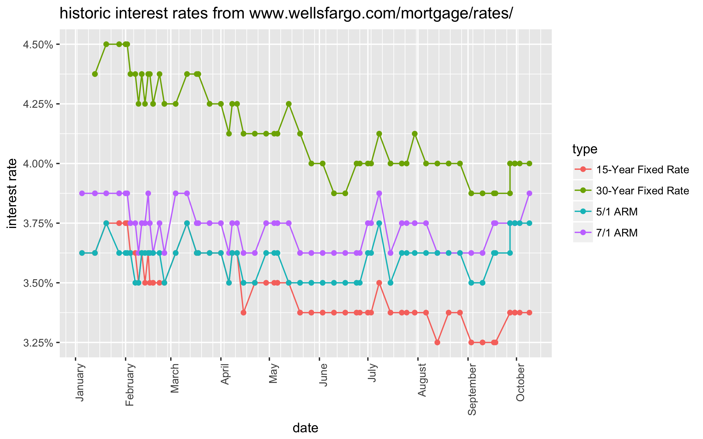

# Wells Fargo Rate History

We're about to get a mortgage through Wells Fargo. We noticed that the rate we were quoted ealier this week was lower than the rate in the documents we were asked to sign.

Since it's possible that the interest rates could have changed over the last few days, we decided to use the [Wayback Machine](https://archive.org/web/) to understand what the Wells Fargo public rates have been doing.

